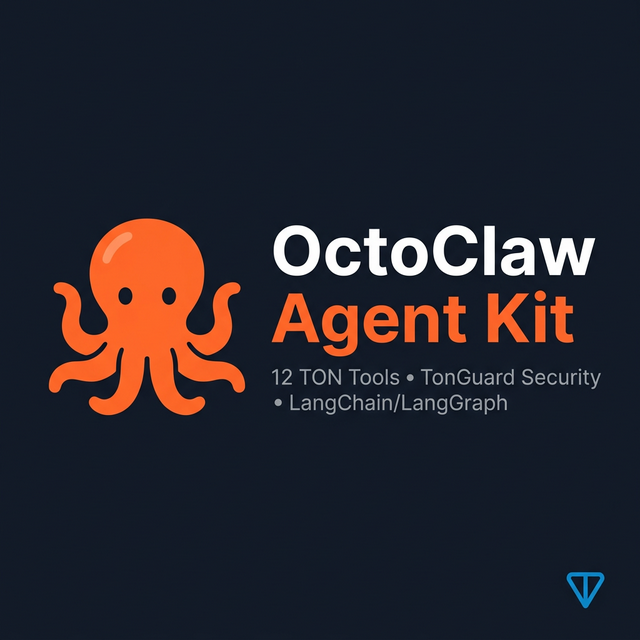

<p align="center">
  
</p>

<h1 align="center">🐙 OctoClaw SDK</h1>

<p align="center">
  <b>Secure AI Agent Toolkit for TON blockchain</b><br/>
  19 tools • TonGuard security • LangChain/LangGraph ready
</p>

<p align="center">
  <a href="packages/ton-agent-kit/">TypeScript SDK</a> •
  <a href="packages/tonguard-py/">Python SDK</a> •
  <a href="TONGUARD.md">Security Spec</a> •
  <a href="PROTOCOL.md">Economy Protocol</a>
</p>

---

## What is this?

OctoClaw SDK lets you build **secure AI agents** on TON blockchain in minutes. Your agent gets 19 tools out of the box — wallet management, DeFi swaps, staking, price charts, gasless transactions, P2P prices, NFT listing, DNS resolution — all protected by **TonGuard**, a confirmation-code-based security layer that prevents AI agents from draining wallets.

## Quick Start — 5 Lines

```typescript
import { TonAgentKit } from '@octoclaw/ton-agent-kit';

const kit = new TonAgentKit({
  mnemonic: process.env.TON_MNEMONIC,
  guard: { dailyLimitTon: 10 },
});

const tools = kit.getLangChainTools();
// → 19 TON tools, all TonGuard-protected, ready for your agent
```

```python
from tonguard import TonAgentKit

kit = TonAgentKit(daily_limit=10)
tools = kit.get_langchain_tools()
# → Same 19 tools in Python
```

## Install

```bash
# TypeScript — full toolkit
npm install @octoclaw/ton-agent-kit

# TypeScript — security layer only
npm install @octoclaw/tonguard

# Python — full toolkit + security
pip install tonguard

# Python + LangChain/LangGraph
pip install tonguard[langchain]
```

## 19 Tools — Everything Your Agent Needs

| Tool | What it does | TonGuard |
|------|-------------|:--------:|
| **Wallet** | | |
| `ton_balance` | Wallet balance + address | — |
| `ton_send` | Send TON | ✅ Confirmation codes |
| `ton_price` | Live TON/USD from CoinGecko | — |
| `ton_history` | Transaction history via TonAPI | — |
| **DeFi** | | |
| `ton_swap` | Swap tokens via STON.fi DEX | ✅ |
| `ton_jetton_balance` | All jetton balances (USDT, NOT, SCALE...) | — |
| `ton_jetton_send` | Send jettons | ✅ |
| **NFT & DNS** | | |
| `ton_nft_list` | List NFTs (usernames, domains, collectibles) | — |
| `ton_dns_resolve` | Resolve .ton domains → addresses | — |
| **Security** | | |
| `ton_guard_check` | Pre-check spending limits | — |
| `ton_confirm` | Confirm transaction with code | ✅ |
| `ton_limits` | Current spending stats | — |
| **Staking & DeFi** | | |
| `ton_staking_pools` | All pools with APY, min stake, nominators | — |
| `ton_chart` | Price history with sparkline (any token) | — |
| `ton_gasless_estimate` | Gasless TX config — pay fees in USDT | — |
| `ton_emulate` | Dry-run transactions (preview before send) | — |
| **Analytics** | | |
| `ton_jetton_info` | Token metadata, supply, holders, verification | — |
| `ton_p2p_prices` | Telegram Wallet P2P market prices | — |
| `ton_multisig_info` | Multisig wallet: signers, threshold, orders | — |

## TonGuard — Why This Exists

Every other TON agent SDK gives your AI raw access to send money. That's dangerous.

```
Other SDKs:                          OctoClaw:
                                     
Agent: "Send 100 TON" → ✅ Done     Agent: "Send 100 TON" → ⏳ Code: A7K2X9
                                     User: "A7K2X9" → ✅ Done
No limits, no confirmation.          Daily limits, cooldowns, confirmation codes.
```

**TonGuard features:**
- 🔑 **Confirmation codes** — 6-char cryptographic codes for transactions above threshold
- 📊 **Daily limits** — cap total spending per 24h period
- 🚫 **Per-TX limits** — cap individual transaction size
- ⏱️ **Cooldowns** — minimum time between transactions
- ✅ **Auto-confirm** — skip codes for tiny amounts (configurable)
- ⏰ **Code expiry** — codes expire after 5 minutes

## Framework Support

| Framework | TypeScript | Python |
|-----------|:----------:|:------:|
| LangChain | ✅ | ✅ |
| LangGraph | ✅ | ✅ |
| CrewAI | ✅ | ✅ |
| AutoGen | ✅ | ✅ |
| Plain code | ✅ | ✅ |

## Packages

| Package | Description | Language |
|---------|-------------|----------|
| [`@octoclaw/ton-agent-kit`](packages/ton-agent-kit/) | Full toolkit — 19 tools + TonGuard | TypeScript |
| [`@octoclaw/tonguard`](packages/tonguard-js/) | Security layer only | TypeScript |
| [`tonguard`](packages/tonguard-py/) | Full toolkit + security layer | Python |

## Specs

| Document | Description |
|----------|-------------|
| [TONGUARD.md](TONGUARD.md) | TonGuard security protocol — threat model, confirmation codes, spending policies |
| [PROTOCOL.md](PROTOCOL.md) | Agent Economy Protocol — A2A payments, per-call billing, MCP-to-TON bridge |

## Testing

```bash
# TypeScript
cd packages/ton-agent-kit
npx ts-node test.ts        # 30 tests

# Python
cd packages/tonguard-py
python test_kit.py          # 21 tests
```

## Comparison

| Feature | tonapi-langchain | TON Agent Kit | **OctoClaw SDK** |
|---------|:-----:|:-----:|:-----:|
| Total tools | 5 | 15 pkgs | **19 (one import)** |
| Security | ❌ | ❌ | ✅ TonGuard |
| Daily limits | ❌ | ❌ | ✅ |
| Confirmation codes | ❌ | ❌ | ✅ |
| Cooldowns | ❌ | ❌ | ✅ |
| DeFi (swap) | ❌ | ✅ | ✅ + protected |
| Staking pools + APY | ❌ | ❌ | ✅ |
| Price charts | ❌ | ❌ | ✅ |
| Gasless transactions | ❌ | ❌ | ✅ |
| TX emulation (dry-run) | ❌ | ❌ | ✅ |
| P2P market prices | ❌ | ❌ | ✅ |
| Multisig wallets | ❌ | ❌ | ✅ |
| NFTs | ❌ | ❌ | ✅ |
| DNS resolve | ❌ | ❌ | ✅ |
| Mock testing | ❌ | ❌ | ✅ |
| Framework-agnostic | ❌ | ❌ | ✅ |

## License

MIT
